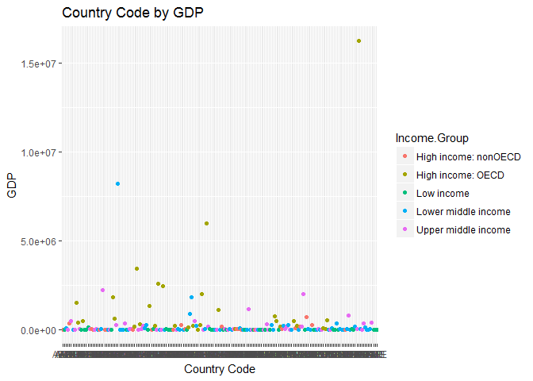
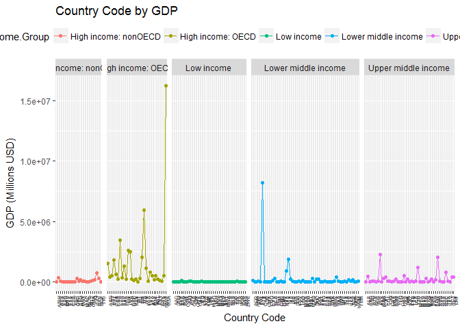

``` r
# Load the merged data file into a data frame named merged_Data
merged_Data <- read.csv("data/merged_Data.txt",header=T, sep = "|")

# Load the GDP data into the data frame named cleaned_GDP_Data
cleaned_GDP_Data <- read.csv("data/cleaned_GDP_Data.txt",header=T, sep = "|")

# Load the Education data into the data frame named cleaned_EDU_Data
cleaned_EDU_Data <- read.csv("data/cleaned_EDU_Data.txt",header=T, sep = "|")

# Load dplyr package
library(dplyr)
```

    ## 
    ## Attaching package: 'dplyr'

    ## The following objects are masked from 'package:stats':
    ## 
    ##     filter, lag

    ## The following objects are masked from 'package:base':
    ## 
    ##     intersect, setdiff, setequal, union

<b>Introduction</b> <br>
<p>
Gross domestic product (GDP) is the monetary value of all the finished goods and services produced within a country's borders in a specific time period. GDP is a broad measurement of a nation’s overall economic activity. GDP data when combined with the other comparable indicators of the countries like education access, progression, completion, literacy, teachers, population, and expenditures could help in understanding how GDP is related these other factors of the various economies in the world. This kind of analysis could lead to study of GDP in a very broader aspect like how the GDP of economies very for countries with high population then countries with low population. In this study, we will view and analyze GDP with respect to the income groups of the various ecomonies.
</p>
<br> <br>

<b>Question 1: How many IDs matched?</b>

``` r
# The following R code calculates the # of rows after successfully merging the GDP and Education datasets.
nrow(merged_Data)
```

    ## [1] 189

``` r
# Country codes in GDP data which were not matched
select(cleaned_GDP_Data[!cleaned_GDP_Data$Country.Code %in% merged_Data$Country.Code,],Country.Code)
```

    ##     Country.Code
    ## 131          SSD

``` r
# Country codes in Education data which were not matched
select(cleaned_EDU_Data[!cleaned_EDU_Data$CountryCode %in% merged_Data$Country.Code,],CountryCode)
```

    ##     CountryCode
    ## 2           ADO
    ## 9           ASM
    ## 35          CHI
    ## 46          CYM
    ## 50          DJI
    ## 64          FRO
    ## 76          GRL
    ## 78          GUM
    ## 86          IMY
    ## 109         LBY
    ## 111         LIE
    ## 128         MMR
    ## 131         MNP
    ## 138         NCL
    ## 155         PRK
    ## 158         PYF
    ## 170         SMR
    ## 171         SOM
    ## 181         TCA
    ## 201         VIR
    ## 204         WBG

<br>

<b>Question 2: Sort the data frame in ascending order by GDP (so United States is last). What is the 13th country in the resulting data frame?</b>

``` r
# The following R code sorts the Merged Data file in increasing order of GDP
# sort_by_GDP <- merged_Data[order(merged_Data$GDP.in.Millions.USD),]
sort_by_GDP <- arrange(merged_Data,GDP.in.Millions.USD)

#Verify the last country in the sorted data frame is United States
tail(sort_by_GDP$Country, n=1)
```

    ## [1] United States
    ## 189 Levels: Afghanistan Albania Algeria Angola ... Zimbabwe

``` r
# Find the 13th country in the sorted data set. 
sort_by_GDP[13,c("Country.Code","Country","GDP.in.Millions.USD","GDP.Ranking")]
```

    ##    Country.Code             Country GDP.in.Millions.USD GDP.Ranking
    ## 13          KNA St. Kitts and Nevis                 767         178

``` r
# "St. Kitts and Nevis" is the 13 country in ascending order of GDP of the 189 countries in the merged data.
# Its country code is KNA, GDP Rank is 178 and GDP is 767 Million USD.
```

<br>

<b>Question 3: What are the average GDP rankings for the "High income: OECD" and "High income: nonOECD" groups</b>

``` r
# get average of all high income: OECD
# hioecd <- merged_Data[merged_Data$Income.Group=="High income: OECD",]
# mean(hioecd$GDP.Ranking)
# get average of all high income: nonOECD
# hinonoecd <-merged_Data[merged_Data$Income.Group=="High income: nonOECD",]
# mean(hinonoecd$GDP.Ranking)

# This following R code calculates the the average GDP rankings for the "High income: OECD" 
#  and "High income: nonOECD" groups
merged_Data %>% 
  # filter records to have rows with "High income: OECD" and "High income: nonOECD" income group
  filter(Income.Group=='High income: nonOECD' | Income.Group=='High income: OECD') %>% 
  # Group the data by income group 
  group_by(Income.Group) %>% 
  # Compute the mean of GDP Ranking
  summarize(mean(GDP.Ranking)) %>%
  # Convert the result into a Data Frame so as to make it more readable
  as.data.frame %>%
  # Assign proper column headings
  setNames(c("Income.Group", "Mean.GDP.Ranking"))
```

    ##           Income.Group Mean.GDP.Ranking
    ## 1 High income: nonOECD         91.91304
    ## 2    High income: OECD         32.96667

<br>

<b>Question 4: Plot the GDP for all of the countries. Use ggplot2 to color your plot by Income Group.</b>

``` r
# plot GDP
library(ggplot2)
qplot(Country.Code, GDP.in.Millions.USD, data=merged_Data, color=Income.Group, geom="point", xlab="Country Code", ylab="GDP", main="Country Code by GDP")
```



``` r
# Since most of the GDP values are very small (almost 0) compared to GDP of USA, it is difficult 
# to draw any meaningful inferences from the graph. So based on the income group, split the graph 
# sa as to make it readable and draw some inferences out from it.
ggplot(merged_Data, aes(x=Country.Code,y=GDP.in.Millions.USD, colour=Income.Group, group=Income.Group )) + geom_point() + geom_line() + theme(legend.position="top", axis.text.x = element_text(angle = 90, hjust = 1, size=5, vjust=1)) + facet_grid(. ~ Income.Group, scales = "free", space="free") + xlab("Country Code") + ylab("GDP (Millions USD)") + ggtitle("Country Code by GDP")
```

 <br>

<b>Question 5: Cut the GDP ranking into 5 separate quantile groups. Make a table versus Income.Group. How many countries are Lower middle income but among the 38 nations with highest GDP?</b>

``` r
# cut the GDP ranking into 5 separate quantile groups
ApplyQuantiles <- cut(merged_Data$GDP.Ranking, breaks=5)

# create a table with Income Group vs GDP Ranking Quantiles 
Income_vs_GDP_rank_quantiles <- table(merged_Data$Income.Group, ApplyQuantiles)

# View the table created
Income_vs_GDP_rank_quantiles
```

    ##                       ApplyQuantiles
    ##                        (0.811,38.8] (38.8,76.6] (76.6,114] (114,152]
    ##   High income: nonOECD            4           5          8         4
    ##   High income: OECD              18          10          1         1
    ##   Low income                      0           1          9        16
    ##   Lower middle income             5          13         12         8
    ##   Upper middle income            11           9          8         8
    ##                       ApplyQuantiles
    ##                        (152,190]
    ##   High income: nonOECD         2
    ##   High income: OECD            0
    ##   Low income                  11
    ##   Lower middle income         16
    ##   Upper middle income          9

``` r
# Assign proper column heading to the table
colnames(Income_vs_GDP_rank_quantiles) <- c("1-38","39-76","77-114", "115-152", "153-190")

# Number of countries in lower middle income that are among the 38 nations in the highest quantile group
Income_vs_GDP_rank_quantiles["Lower middle income","1-38"]
```

    ## [1] 5

<br>

<b>Conclusion</b> <br>
<p>
</p>
